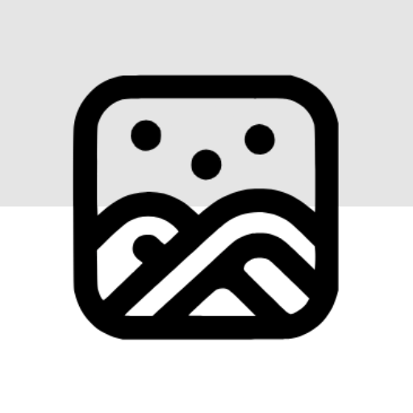

# Reverie - Your Digital Memory Keeper



Reverie is a beautiful and intuitive mobile application that helps you capture, organize, and relive your precious memories through photos, videos, and journal entries. Built with Flutter, it offers a seamless experience across iOS and Android platforms.

## 🚀 Getting Started

### 📱 Download APK
Currently, Reverie is available for Android devices only. You can download the APK from:

<div align="center">
  <a href="https://github.com/amandangol/reverie/releases/latest">
    
  </a>
  <a href="https://drive.google.com/file/d/your-file-id/view">
    
  </a>
</div>

### 🖼️ Reverie Glimpses

                  

## 🌟 Features

### 📸 Gallery & Media
- Beautiful gallery view of your photos and videos
- Smart organization with albums and collections
- Video library for easy access to your video memories
- Favorites collection for quick access to special moments
- Built-in camera for capturing photos and videos
  - High-quality photo capture
  - Video recording up to 10 minutes
  - Quick access from gallery
  - Instant saving to gallery
- Photo editing capabilities
  - Filters and effects
  - Basic adjustments (brightness, contrast, etc.)
  - Crop and rotate
  - Text and sticker overlays
- Google Drive integration for secure backup and restoration
  - One-click backup of selected albums
  - Automatic organization in Google Drive
  - Easy restoration of backed-up content
  - Secure authentication with Google accounts
-  Search & Organization
  - Quick search across all media files
  - Filter by date, type, and tags
  - Sort albums by name, date, or size

### 📝 Journal & Memories
- Create rich journal entries with photos and videos
- Track your mood and emotional journey
- Calendar view to browse entries by date
- Add tags and categories for better organization
- AI-powered content generation to help express your thoughts
- Multi-language support for journal entries
  - Translate entries to 40+ languages
  - Real-time translation
  - Language-specific formatting
  - Easy language switching
  - Flag indicators for translated content
- Efficient Journal Management
  - Quick search through journal entries
  - Sort entries by date, mood, or tags
  - Filter entries by content type
  - Advanced text search within entries
  - Export and share functionality

### ⏳ Flashbacks & Calendar
- Relive past memories with the flashbacks feature
- Time-based memory organization
- Easy navigation through your memory timeline

### 📅 Recap & Memories
- Monthly memory recaps with beautiful timeline view
- Smart date-based grouping of memories
- Quick month navigation with visual calendar
- Memory count tracking for each month
- Beautiful grid layout for memory browsing

### 🤖 AI-Powered Features
- Smart image analysis and description generation
- AI-assisted journal writing
- Object Labeling for image
- Text recognition in images
- Personalized content suggestions

### 🔄 Backup & Sync
- Secure Google Drive integration
- Selective album backup
- Progress tracking during backup
- Easy restoration process
- Account-specific backup management
- Automatic backup status indicators
- Secure authentication with Google accounts

## 🎥 Demo Videos

### 📸 Gallery & Media Features

- [Gallery Overview](https://github.com/user-attachments/assets/355e92dc-b1bc-478f-aa45-31ba4281e4f3)

- [Photo Editing](https://github.com/user-attachments/assets/3ef6a2ef-9cc5-49df-8314-726f5ffb2418)

- [Album Management](https://github.com/user-attachments/assets/3ba9dbfe-99ba-47d4-9e7b-7bae64d19020)

- [Camera Preview](https://github.com/user-attachments/assets/547013b3-dfec-4fad-aa5b-cf810667d348)

### 📝 Journal & Memories

- [Journal Features](https://github.com/user-attachments/assets/34eef0bc-1a1d-4496-8b4c-e6c7d3447f35)

- [Journal Sharing](https://github.com/user-attachments/assets/3e0c854c-6553-4554-975f-ed5ffb96b1a9)

- [Memories & Recaps](https://github.com/user-attachments/assets/5ce43d20-28f8-400e-9f37-1a0299b06936)

### 🤖 AI Features

- [AI Capabilities](https://github.com/user-attachments/assets/10b73108-14ec-4c87-81e1-4b15be1aac2b)

### 🔄 Backup & Additional Features

- [Google Drive Backup](https://github.com/user-attachments/assets/5bdaf89a-a6c5-4342-bd6c-caa202604784)

- [Additional Information](https://github.com/user-attachments/assets/7284e09d-d26e-4756-b388-c02d7804c4f8)


### Prerequisites
- Flutter SDK (version 3.4.0 or higher)
- Dart SDK (version 3.4.0 or higher)
- Android Studio / Xcode for emulators
- Git

### Installation

1. Clone the repository:
```bash
git clone https://github.com/amandangol/reverie.git
cd reverie
```

2. Install dependencies:
```bash
flutter pub get
```

3. Run the app:
```bash
flutter run
```

### Building for Production

#### Android
```bash
flutter build apk --release
```

#### iOS
```bash
flutter build ios --release
```

## 🛠️ Technical Details

### Architecture
- Built with Flutter for android (currently) compatibility
- Uses Provider for state management
- Implements Material Design 3 for modern UI
- Follows clean architecture principles
- Google Drive API integration for backup functionality

### Key Dependencies
- `provider`: State management
- `shared_preferences`: Local storage
- `photo_manager`: Media handling
- `photo_manager_image_provider`: Image loading
- `url_launcher`: External link handling
- `google_sign_in`: Google authentication
- `googleapis`: Google Drive API integration
- `image_picker`: Camera and gallery access
- `google_mlkit_translation`: Translation services
- `pro_image_editor`: Advanced photo editing
- `translator`: Multi-language support
- `table_calendar`: Calendar view for memories
- `just_audio`: Background music for slideshows
- `pdf`: PDF generation for journal entries


## 🔒 Privacy & Security

Reverie takes your privacy seriously:
- All data is stored locally on your device by default
- Optional Google Drive backup with secure authentication
- No cloud synchronization without explicit permission
- Secure media handling
- Optional data export functionality
- Account-specific backup management
- Secure token management for Google Drive access

## 🤝 Contributing

We welcome contributions! Please read our [Contributing Guidelines](CONTRIBUTING.md) for details on our code of conduct and the process for submitting pull requests.

## 📄 License

This project is licensed under the MIT License - see the [LICENSE](LICENSE) file for details.

## 🙏 Acknowledgments

- Flutter team for the amazing framework
- The open-source community for their invaluable tools and libraries

## 📞 Support

If you encounter any issues or have questions:
- Open an issue in the GitHub repository
- Contact me personally at icrextha@gmail.com
- Join our community forum

## 🌟 Why Choose Reverie?

1. **Beautiful Design**: Modern, intuitive interface that makes memory-keeping a joy
2. **Privacy-Focused**: Your memories stay on your device with optional cloud backup
3. **AI-Enhanced**: Smart features that make organizing memories easier
4. **Cross-Platform**: Seamless experience on Android for now
5. **Regular Updates**: Continuous improvements and new features
6. **Secure Backup**: Reliable Google Drive integration for your memories
7. **Multi-language Support**: Translate your memories to share with anyone
8. **Built-in Camera**: Capture moments directly in the app

## 📱 App Screenshots

### 🖼️ Gallery & Media

<div align="center">
  
  
  
  
  
  
  
</div>

---

### 📔 Journal

<div align="center">
  
  
  
  
  
  
</div>

---

### 🤖 AI & Media Info

<div align="center">
  
  
  
</div>

<div align="center">
  
  
</div>

### 🌟 Flashbacks & Monthly Recap

<div align="center">
  
  
  </div>

---

### ☁️ Backup & Quick Actions

<div align="center">
  
  
</div>
---

Made with ❤️ by amandangol AKA 4m.4n
